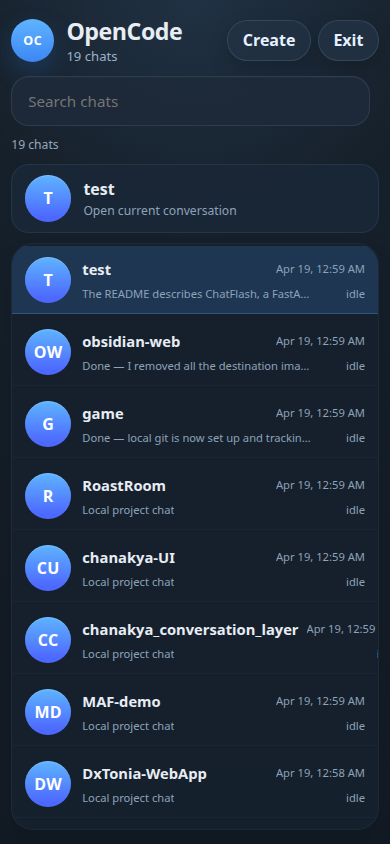
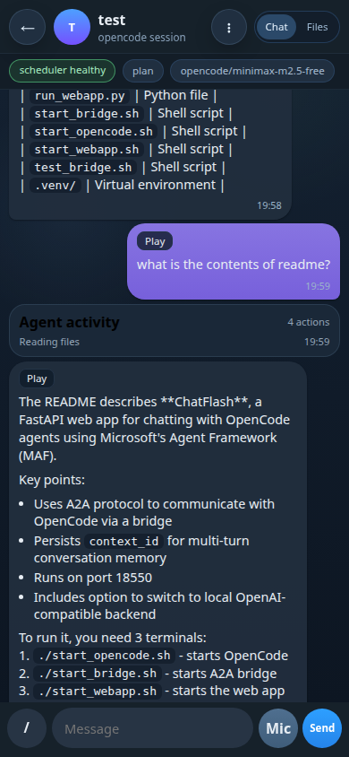
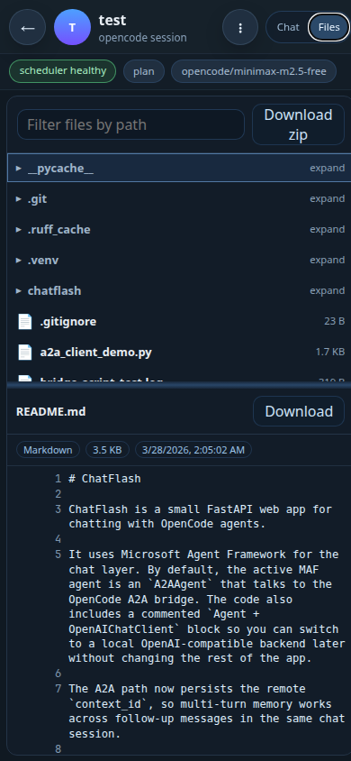
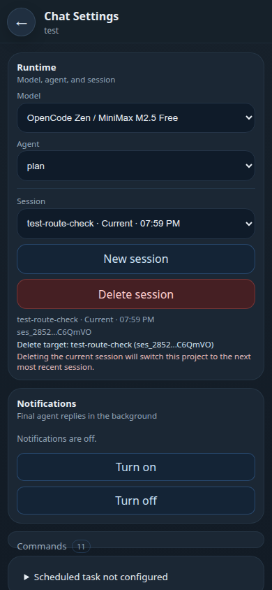
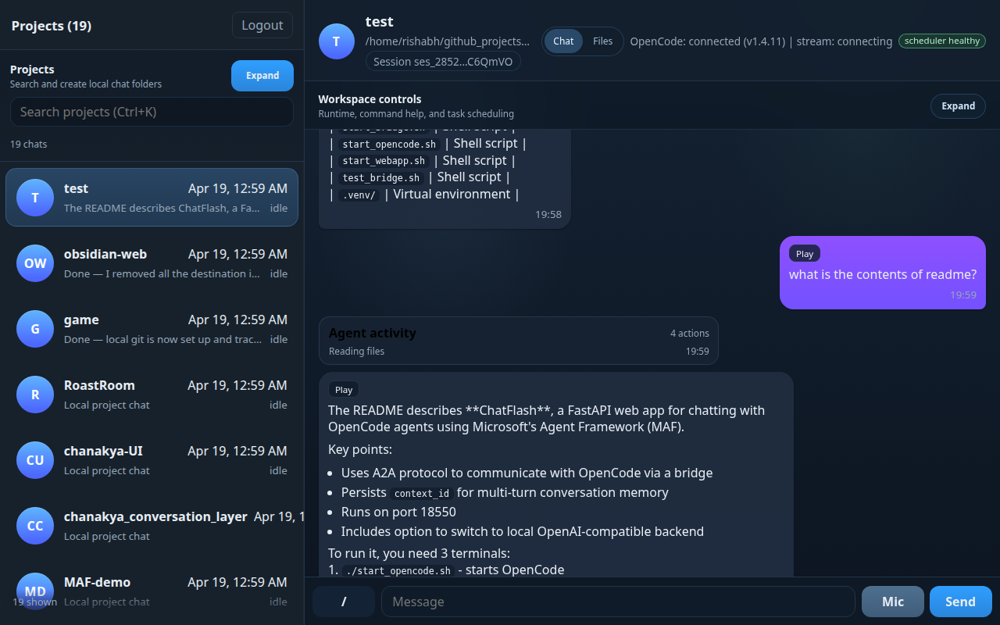
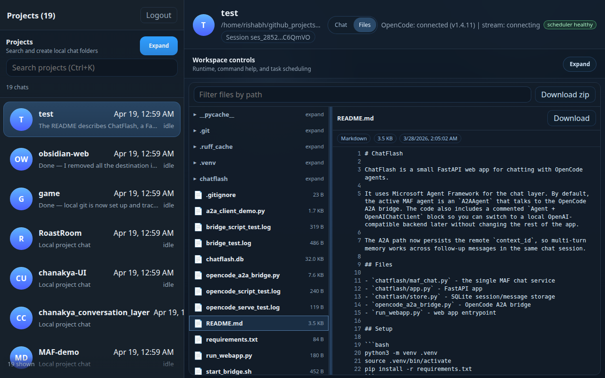

# OpenCode Web Controller

**Build full-stack apps from your phone. Work from anywhere.**

A mobile-first, Telegram-like web controller for local OpenCode sessions. No desktop required, no expensive API subscriptions - just connect to OpenCode's free models or any OpenAI-compatible endpoint and start coding from your phone.

- **Mobile-first** — Control your dev environment from phone or desktop
- **Voice-ready** — Built-in STT/TTS for hands-free coding
- **File explorer** — Browse, search, preview, and download project files directly in-chat
- **Scheduled tasks** — Set up autonomous agents that run on autopilot (experimental, not tested yet)
- **Approval flow** — Review and approve dangerous changes before execution
- **Real-time streaming** — Watch code being written as it happens
- **Multi-project** — Manage unlimited projects with instant switching

## Screenshots

### Mobile Views

| Project List | Chat View | Files View | Menu |
|-------------|-----------|------------|------|
|  |  |  |  |

### Desktop Views

| Main Chat | File Explorer |
|----------|--------------|
|  |  |

## Roadmap

**Shipping now (v0.1.x)** — Core chat, streaming, voice, file browser, scheduled tasks.

**Coming soon:**
- PWA installability for offline use
- Windows native support (PowerShell scripts)
- Sidebar resizing for desktop
- Performance optimizations for 1000+ projects
- Containerized deployment (Docker/Compose)

**Planned:**
- Plugin/extension system
- Team collaboration features
- Cloud deployment options

Up-to-date status at [tasks.md](./tasks.md).

## Stack

- Frontend: React 18 + TypeScript + Vite
- Backend: Flask + SQLAlchemy
- Default DB: SQLite (`backend/data/app.db`)
- Host OS target: Linux

## Prerequisites

- Python 3.11+
- Node.js 20+
- npm
- `opencode` CLI available in `PATH`

## Host-native only

- This project is host-native (Python + Node + systemd).

## Interactive setup

Run the guided setup to install dependencies, configure voice mode, and optionally install systemd services:

```bash
./scripts/setup.sh
```

The setup script can:

- install OpenCode CLI if missing (`curl -fsSL https://opencode.ai/install | bash`)
- configure built-in CPU voice or external OpenAI-compatible endpoints
- set default project root path
- optionally install/restart autostart services

## Quick Start (Linux)

1. Create and activate virtualenv:

```bash
python3 -m venv .venv
source .venv/bin/activate
```

2. Install dependencies:

```bash
pip install --upgrade pip
pip install -r backend/requirements.txt
npm --prefix frontend install
```

3. Prepare environment file:

```bash
cp .env.example .env
```

4. Start services (required order):

```bash
# Terminal 1
opencode serve --hostname 127.0.0.1 --port 4096 --cors http://localhost:5173

# Terminal 2
source .venv/bin/activate
python backend/run.py

# Terminal 3
npm --prefix frontend run dev
```

5. Open app:

- Frontend: `http://localhost:5173`
- Backend health: `http://localhost:8080/api/health`

## One-command start/stop

Use helper scripts for local development:

```bash
./scripts/start-app.sh
./scripts/stop-app.sh
```

`start-app.sh` starts:

- OpenCode server on an app-owned free localhost port
- Flask backend via `.venv/bin/python`
- Frontend dev server on `localhost:5173`

Runtime logs/metadata are written under `.runtime/`.

## Auto-start on Ubuntu (systemd)

Install the systemd stack:

```bash
sudo ./scripts/install-autostart-ubuntu.sh
```

If `opencode` is in a custom location:

```bash
sudo ./scripts/install-autostart-ubuntu.sh --opencode-bin "$(which opencode)"
```

Created units:

- `mobile-opencode-control-opencode.service`
- `mobile-opencode-control-backend.service`
- `mobile-opencode-control-frontend.service`
- `mobile-opencode-control.target`

Useful commands:

```bash
sudo systemctl status mobile-opencode-control.target
sudo journalctl -u mobile-opencode-control-opencode.service -f
sudo journalctl -u mobile-opencode-control-backend.service -f
sudo journalctl -u mobile-opencode-control-frontend.service -f
```

### Restart after code changes

If you changed app code (frontend/backend) and want systemd to pick it up:

```bash
# Restart full stack
sudo systemctl restart mobile-opencode-control.target

# Check overall status
sudo systemctl status mobile-opencode-control.target
```

If only one service changed, restart just that service:

```bash
sudo systemctl restart mobile-opencode-control-frontend.service
sudo systemctl restart mobile-opencode-control-backend.service
sudo systemctl restart mobile-opencode-control-opencode.service
```

If you edited unit files or re-ran installer script, reload systemd first:

```bash
sudo systemctl daemon-reload
sudo systemctl restart mobile-opencode-control.target
```

If frontend fails after dependency changes, reinstall deps and restart frontend:

```bash
npm --prefix frontend ci
sudo systemctl restart mobile-opencode-control-frontend.service
```

Uninstall:

```bash
sudo ./scripts/uninstall-autostart-ubuntu.sh
```

## API Endpoints (Current)

- `POST /api/auth/login`
- `POST /api/auth/logout`
- `GET /api/auth/me`
- `GET /api/health`
- `GET /api/opencode/health`
- `GET /api/projects`
- `POST /api/projects`
- `POST /api/projects/:id/select`
- `POST /api/projects/:id/session/ensure`
- `GET /api/projects/:id/messages`
- `POST /api/projects/:id/messages`
- `POST /api/projects/:id/commands`
- `GET /api/projects/:id/diff`
- `GET /api/projects/:id/stream` (SSE)
- `POST /api/projects/:id/permissions/:permissionId`
- `GET /api/state`

## Notes

- Frontend dev server proxies `/api` to `http://localhost:8080`.
- To use PostgreSQL, set `DATABASE_URL` in `.env`.
- `.env`, `.runtime`, local screenshots, and test captures are ignored by default.

## Voice modes

Voice is controlled by `.env`:

- `VOICE_PROVIDER_MODE=builtin`: uses built-in CPU voice (`faster-whisper` + Coqui TTS)
- `VOICE_PROVIDER_MODE=external`: uses OpenAI-compatible `STT_BASE_URL` / `TTS_BASE_URL`
- `VOICE_PROVIDER_MODE=auto`: uses external endpoints if configured, otherwise built-in

Built-in defaults are CPU-first:

- `BUILTIN_STT_DEVICE=cpu`
- `BUILTIN_STT_COMPUTE_TYPE=int8`
